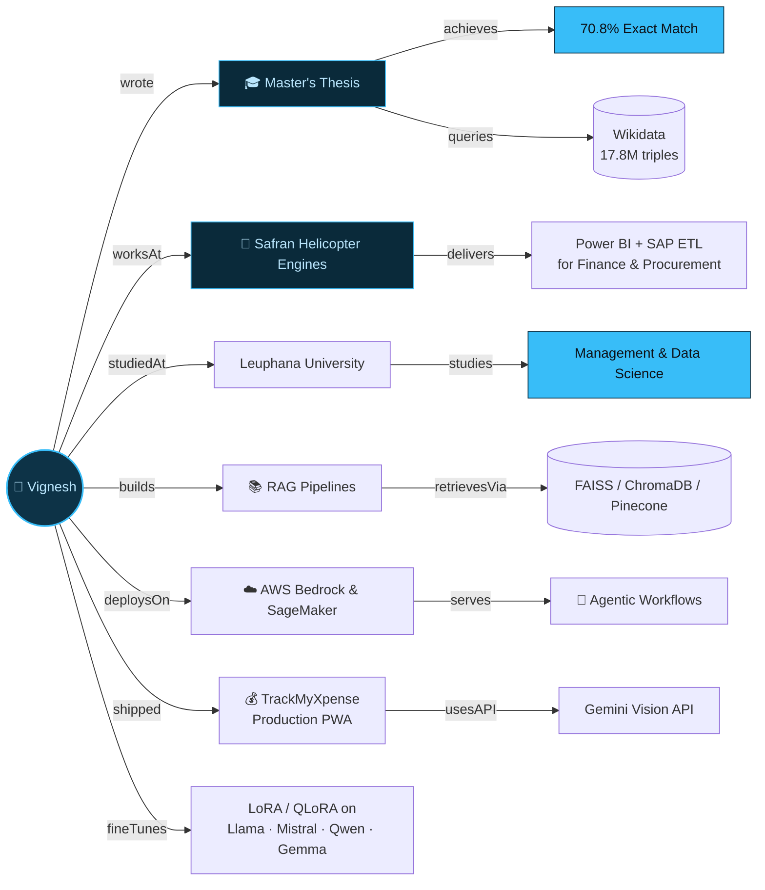

<h1 align="center">
  
</h1>

<div align="center">


</div>

<div align="center">

<a href="mailto:vignesh.mallya315@gmail.com" target="_blank" rel="noopener noreferrer"></a>
<a href="https://linkedin.com/in/v-mallya" target="_blank" rel="noopener noreferrer"></a>
<a href="https://mallya.vercel.app" target="_blank" rel="noopener noreferrer"></a>


</div>

---

## 🧑‍💻 Who I Am

```typescript
const vigneshMallya = {
  title:       "AI Engineer — GenAI, RAG & Agentic Systems",
  experience:  "5+ years software engineering",
  stack: {
    genAI:      ["LangChain", "LangGraph", "LlamaIndex", "RAG Pipelines", "vLLM", "RAGAS"],
    knowledgeGraphs: ["SPARQL 1.1/1.2 (RDF-star)", "GraphDB", "Wikidata", "DBpedia", "RDF/RDFS/OWL/SHACL"],
    fineTuning: ["LoRA / QLoRA (HF PEFT)", "Llama", "Mistral", "Qwen", "Gemma"],
    cloud:      ["AWS Bedrock", "AWS SageMaker", "Azure OpenAI Service", "Copilot Studio"],
    fullStack:  ["Python", "TypeScript", "React", "Node.js", "FastAPI", "Docker"],
  },
  currentRole: "Working Student, Data Analyst @ Safran Helicopter Engines",
  education:   "M.Sc. Management & Data Science — Leuphana University (2023–Present)",
  thesis:      "NL → SPARQL 1.2 (RDF-star) with LLMs — 56% → 70.8% exact match via LoRA",
  openTo:      "Full-time AI Engineer roles — Germany · EU · Remote",
};
```

---

## 🕸️ My Knowledge Graph, Visualised



---

## 🎓 Flagship Research

<table>
<tr>
<td width="70%">

### NL → SPARQL 1.2 (RDF-star) Query Generation with LLMs
**Master's Thesis · Leuphana University**

Benchmarked **4 open-source LLMs** (Qwen2.5-7B, Llama-3.1-8B, Mistral-7B, Gemma-2-9B) across **12 prompting strategies** on **500 questions**, against a **17.8M-triple Wikidata** knowledge graph in GraphDB — supporting both SPARQL 1.1 and 1.2 (RDF-star).

Then LoRA fine-tuned Qwen2.5-7B on 3,400 task-specific examples, served via vLLM.

</td>
<td width="30%" align="center">

**56% → 70.8%**
exact match
_(+14.8pp via LoRA)_

**100%**
query validity

**65.4%**
structural match

</td>
</tr>
</table>

`Wikidata` `GraphDB` `SPARQL 1.1/1.2` `vLLM` `LoRA (HF PEFT)` `Python`

---

## 🧰 Tech Stack

**🧠 LLMs & GenAI**


**🕸️ Knowledge Graphs & RDF**


**⚙️ Core Stack**


**🗄️ Vector Databases**


**🧩 AI Dev Tooling**


---

## 🛠️ Featured Builds

| | |
|---|---|
| **🤖 Multi-Agent Research Assistant**<br>5 specialised agents (Router, Research, Summarizer, Writer, Chitchat) orchestrated via LangGraph conditional edges; FAISS semantic retrieval (L2-normalised OpenAI embeddings) over a custom PDF knowledge base. | `LangGraph` `FAISS` `OpenAI API` `LangChain` |
| **📄 RAG Document Chat Assistant**<br>End-to-end RAG: multi-format ingestion → semantic chunking → ChromaDB → LLM synthesis, served via FastAPI + Docker. RAGAS-based eval (recall@10, faithfulness, answer relevance). | `LangChain` `LlamaIndex` `ChromaDB` `RAGAS` `FastAPI` `Docker` |
| **🍽️ Restaurant Booking Agent**<br>AWS Bedrock Agent combining a RAG Knowledge Base (OpenSearch Serverless) with Lambda-backed CRUD against DynamoDB — natural-language menu queries and bookings. | `AWS Bedrock` `OpenSearch` `Lambda` `DynamoDB` `Claude Sonnet 4.5` |
| **🔗 NL → SPARQL 1.1 Knowledge Graph Assistant**<br>Solo pipeline: few-shot prompting with Mistral → SPARQL 1.1 → DBpedia. **80% (12/15)** successful execution rate on a graded test set. | `Mistral` `Few-Shot Prompting` `SPARQL 1.1` `DBpedia` |
| **💰 TrackMyXpense — AI Finance PWA**<br>Production personal-finance PWA with multimodal receipt scanning via Google Gemini Vision API, served through Supabase Edge Functions. [Live ↗](https://trackmyxpense.vercel.app) | `React` `Supabase` `Gemini Vision API` `Vercel` |

<details>
<summary><b>➕ Other projects</b></summary>
<br>

- **Student Exam Performance Predictor** — MLOps, dual-cloud CI/CD (AWS Elastic Beanstalk + Azure)
- **MaoArm** — Computer vision & robotic arm control (MediaPipe, real-time gesture recognition)
- **Bayesian Machine Unlearning** — PyTorch, CIFAR-10
- **Education AI Chatbot** — RNN, TF-IDF

</details>

---

## 📊 GitHub Stats

<div align="center">


</div>

---

## 🎓 Education

**M.Sc. Management & Data Science** — Leuphana University of Lüneburg, Germany *(Oct 2023 – Present)*
Machine Learning · Deep Learning · Probabilistic Modelling · Forecasting & Simulation · Mathematics for Data Science

**B.E. Information Science & Engineering** *(CGPA 9.02/10)* — Dr. Ambedkar Institute of Technology, Bangalore, India *(2015 – 2019)*
Big Data Analytics · Python · Database Management Systems · Data Structures & Algorithms

---

## 🌐 Languages

`English` Fluent (C1) &nbsp;·&nbsp; `German` A2, targeting B1 by Q4 2026 &nbsp;·&nbsp; `Hindi / Kannada / Konkani` Native / Fluent

---

## 📫 Let's Connect

I'm always up for a good conversation about AI, data, weird ML papers, or just life in general.

<div align="center">

**📬 vignesh.mallya315@gmail.com** &nbsp;|&nbsp; **[LinkedIn](https://linkedin.com/in/v-mallya)** &nbsp;|&nbsp; **[mallya.vercel.app](https://mallya.vercel.app)**

</div>


